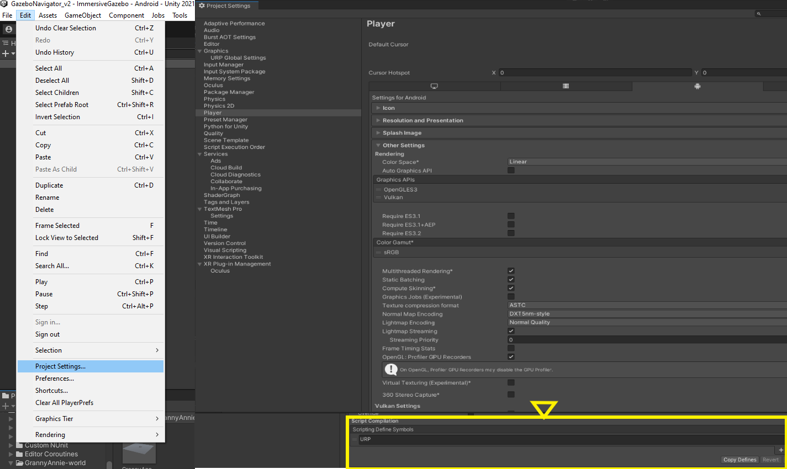

# GrannyAnnie-UnityWorld

---

## Introduction  

This repository contain scripts used to generate urdf files of GrannyAnnie gazebo world models, all steps follow are written on the wiki. Also, it contain unity package with GrannyAnnie world prefab to import this world to any unity scene.  

## Using the Package  
### Adding the GrannyAnnie Unity World package  

1. Open the Package Manager from Unity Menu. Click `Window -> Package Manager`. A new package manager window will appear.  

2. Click on the `+` sign on the top left corner of the package manager window and click on `Add Package from Git URL`.  

  

3. Enter the git URL for the GrannyAnnie-world with the latest version tag (currently v0.0.1) `https://github.com/patricia241/GrannyAnnie-UnityWorld.git?path=/com.unity.robotics-world.grannyannie-unityworld#v0.0.1` in the text box and click `Add`.

Once the package is imported, a folder called GrannyAnnie-world will appear in Packages, inside it in Resources/Prefabs/GrannyAnnieWorld we will find the world prefab ready to be included in our scene. In the event that all the prefabs are pink, follow these steps:  

1. Select "Edit" on the Unity menu bar and click "Project Settings".
2. The "Project Settings" window will open. Click "Player" in the left panel.
3. In the right pane, scroll down to the "Other Settings" section. 
4. Look for the "Scripting Define Symbols" option.
5. Add "URP" to the end of the text field. Be sure to separate it from other symbols with a semicolon (;).  

After adding "URP" to the list of symbol definitions, make sure to save the settings by clicking "Apply" or "OK" at the bottom of the window. Then, restart Unity for the changes to take effect.  

